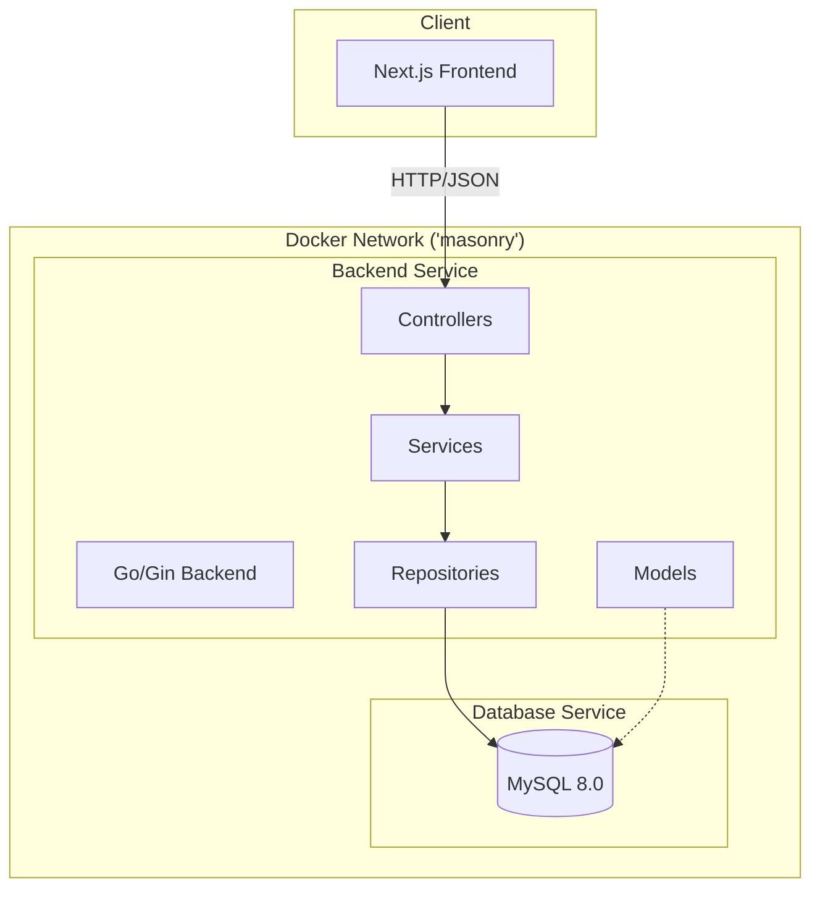

# Masonry Project Architecture

โปรเจกต์นี้เป็นแอปพลิเคชันที่ประกอบด้วยเทคโนโลยีสมัยใหม่ แบ่งออกเป็นส่วนของ Backend (Go) และ Frontend (Next.js) โดยใช้ Docker สำหรับการจัดการสภาพแวดล้อมและการทำงานร่วมกัน

## แผนภาพสถาปัตยกรรม (System Architecture)



---

## ส่วนประกอบสำคัญ (Core Components)

### 1. Frontend (Next.js)
ตั้งอยู่ในโฟลเดอร์ `masonry-frontend/public`
- **Framework**: Next.js 16 (App Router)
- **Library**: React 19
- **Styling**: TailwindCSS 4
- **Features**: แสดงผลรูปภาพแบบ Masonry Layout (ใช้ `react-masonry-css`)
- **Container**: Node.js 24.3.0-alpine

### 2. Backend (Go)
ตั้งอยู่ในโฟลเดอร์ `masonry-backend/public`
- **Language**: Go 1.25.6
- **Framework**: Gin-Gonic (Web Framework)
- **Database ORM**: GORM
- **Pattern**: MVC (Model-View-Controller) ร่วมกับ Service-Repository Pattern
    - **Models**: นิยามโครงสร้างข้อมูลและ Schema
    - **Repositories**: จัดการการเชื่อมต่อและ Query ข้อมูลจาก Database
    - **Services**: เก็บ Business Logic ของแอปพลิเคชัน
    - **Controllers**: จัดการ Request/Response (API Endpoints)
- **Container**: Go 1.25.6-alpine

### 3. Database
- **Engine**: MySQL 8.0
- **Connection**: เชื่อมต่อผ่าน Docker Internal Network โดยใช้ GORM Driver

---

## การจัดการระบบ (Infrastructure & Orchestration)

โปรเจกต์นี้ใช้ **Docker Compose** แยกแต่ละบริการออกจากกันเพื่อความอิสระในการ Scale และ Maintain:

1. **Network**: ทั้ง Frontend และ Backend ทำงานบน Bridge Network ชื่อ `masonry` (External)
2. **Environment**: ใช้ `.env` สำหรับกำหนดค่าคอนฟิกต่างๆ เช่น Port และ Database Credentials
3. **Volume Mounting**: ในช่วงพัฒนา (Development) มีการ Mount Source Code เข้าไปใน Container เพื่อการทำงานแบบ Hot-Reload

---

## วิธีการรันโปรเจกต์ (Getting Started)

1. ตรวจสอบให้แน่ใจว่าได้ติดตั้ง Docker และสร้าง Network ชื่อ `masonry` แล้ว:
   ```bash
   docker network create masonry
   ```

2. รัน Backend:
   ```bash
   cd masonry-backend
   docker-compose up -d
   ```

3. รัน Frontend:
   ```bash
   cd masonry-frontend
   docker-compose up -d
   ```

---

## แผนภาพโครงสร้างโฟลเดอร์ (Project Structure)

```text
.
├── masonry-backend/
│   ├── public/             # Go Source Code
│   │   ├── controllers/    # API Handlers
│   │   ├── services/       # Business Logic
│   │   ├── repositories/   # Data Access Layer
│   │   ├── models/         # Database Models
│   │   └── main.go         # Entry Point
│   └── docker-compose.yaml
├── masonry-frontend/
│   ├── public/             # Next.js Source Code
│   │   ├── app/            # App Router (Pages & API)
│   │   ├── components/     # UI Components
│   │   └── package.json
│   └── docker-compose.yaml
└── README.md               # Main Documentation
```
